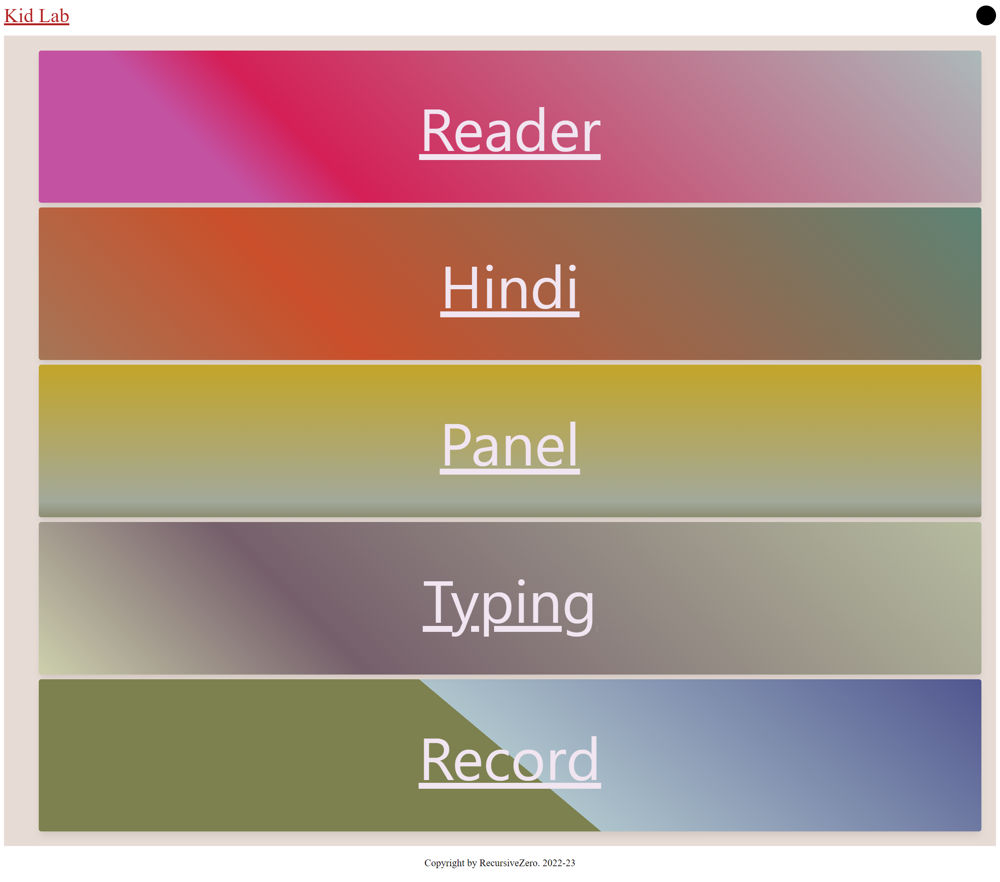
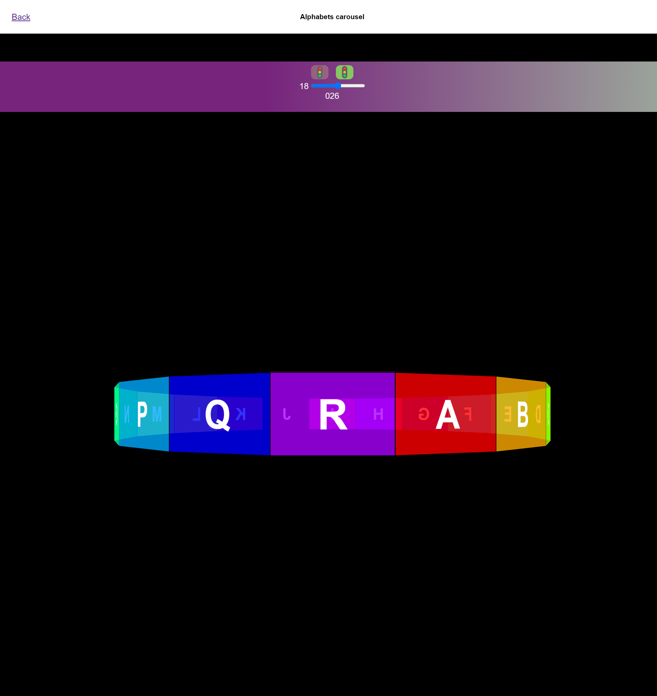
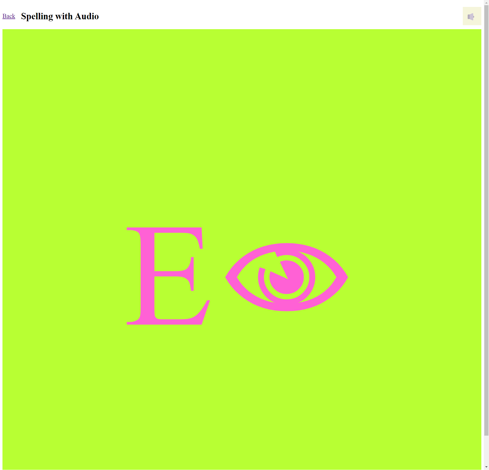
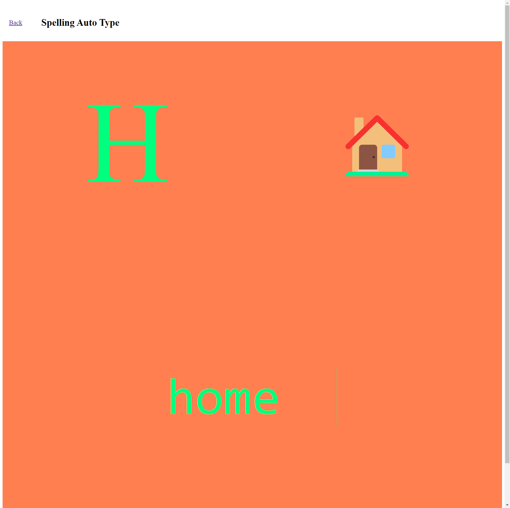

# Kidz

This is few fun and learn practice for kids

## how to start

`npm install`

and

`npm run start`

and open `http://localhost:3000` in the browser

## Screenshot

### Main

### Panel

### Reader

### Typing

