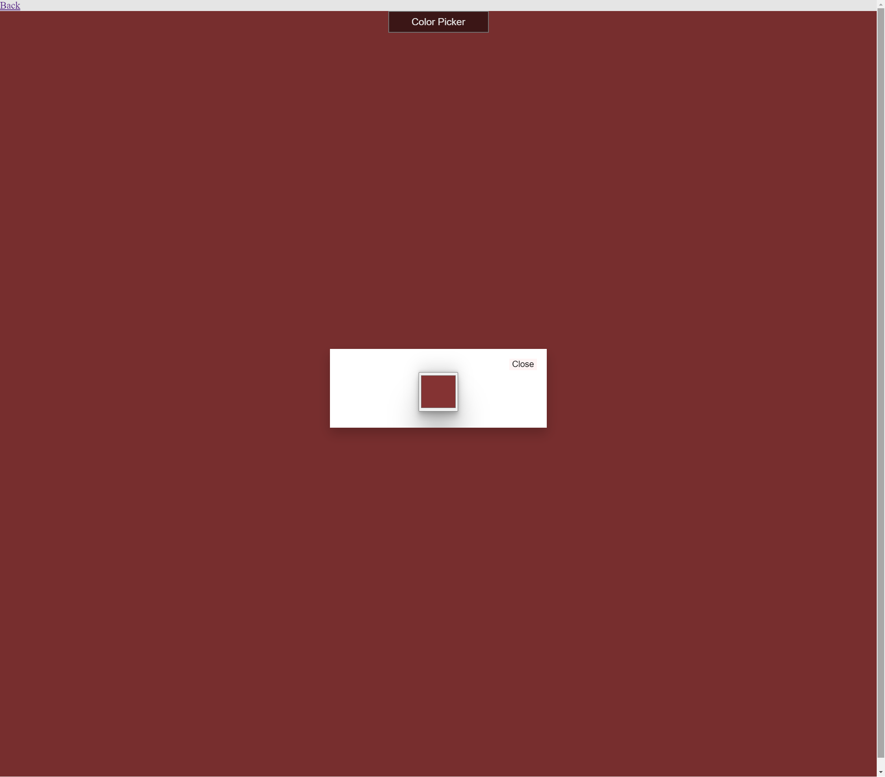

# Kidz

This is few fun and learn practice for kids

## how to start

install dependencies using
`npm install`

and run the project using

`npm run start`

open <http://localhost:3033> in the browser to view

## Screenshot

### Main

### Panel

### Reader

### Typing

### Color The Background

> [!NOTE]  
> Highlights information that users should take into account, even when skimming.

> [!TIP]
> Optional information to help a user be more successful.

> [!IMPORTANT]  
> Crucial information necessary for users to succeed.

> [!WARNING]  
> Critical content demanding immediate user attention due to potential risks.

> [!CAUTION]
> Negative potential consequences of an action.